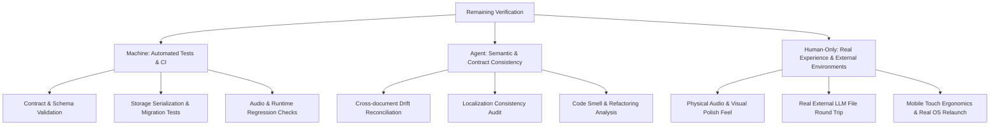

# Quiz Studio — Whole-Product Feature Complete Review V2

**Audit Date**: 2026-08-22  
**Review Type**: Lifecycle Gate Audit (Whole-Product Feature Complete Review V2)  
**Evaluator**: Antigravity / AI Agent Pair Reviewer  
**Repository**: `Peter-S-Shi/Quiz-System`  
**Baseline Commit**: `303b167 Merge pull request #14 from Peter-S-Shi/ui/layered-paper-productization`  
**Current Test Suite**: 239 total / 238 passed / 1 skipped platform-specific Windows launcher test on Linux CI / 0 failed

> [!NOTE]
> **Lifecycle Status Update (Post-Audit)**: This document is preserved as valid historical evidence of the Feature Complete Review V2 audit for baseline commit `303b167`. Following this review, Pre-Freeze Scope Closure, Whole-Product Feature Complete Review V3, Milestone 7 Product Hardening, and Milestone 8 Release Candidate Validation were subsequently completed and accepted. See `PROJECT_STATUS.md` for current lifecycle authority.

---

## 1. Executive Decision

### **RECOMMENDATION: PASS — Declare Feature Complete**

The whole-product release scope for Quiz Studio is **feature complete**. Every planned capability across the Milestone 1–5 baseline, Milestone 6 (Translation Practice & Open Teaching Interchange M6.0–M6.7), pre-hardening local runtime recovery, and Pre-Freeze UI Productization (Layered Paper Study Desk) is fully implemented, structurally integrated, and verified by 239 total automated unit/integration tests (238 passed, 1 skipped platform-specific Windows launcher test on Linux CI, 0 failed) and passing human acceptance gates.

There are **0 Feature Blockers**. No required current-version capability is absent or materially incomplete, and no workflow requires reopening feature development. All remaining findings represent standard **Milestone 7 Product Hardening items**, **Verification Gaps**, **Documentation / Governance Drift**, **Accepted Limitations**, or **Deferred Features**.

Entering **Feature Freeze** is recommended upon formal user confirmation.

---

## 2. Current Release Scope — Reconstructed from Repository Evidence

The current-version release boundary comprises the following concrete capability sets:

1. **Objective Quiz Authoring & Library Management (M1–M5 baseline)**:
   - Paper CRUD (create, edit, duplicate, rename, delete, categorize, tag, search).
   - Five objective question types: Single Choice, Multiple Choice, Fill-in-the-Blank, True/False, One-to-One Matching.
   - Question Type Registry (`src/core/question-registry.js`) with validation and question preparation.
   - Shuffled question options and matching column pairings.
   - In-progress session persistence with refresh recovery (`quiz-studio-active-session-v1`).
   - Immediate grading feedback, answer comparisons, score records, and wrong-question retry.
   - Paper JSON import/export and complete library backup/restore (`src/core/backup.js`).

2. **Open Teaching Interchange Foundation (M6.0)**:
   - Public versioned JSON contracts for Learner Responses, Teacher Reviews, and Quiz Papers (`schemas/`).
   - Finalized, immutable Learner Response evidence containing material snapshots, original submitted answers, score summaries, and provenance (`src/core/interchange.js`, `src/core/learning-records.js`).
   - Portable JSON export from result screens and history entries.

3. **Translation Domain & Library Workspace (M6.1–M6.2)**:
   - Translation Folder, Document, and ordered Item domain aggregate (`src/core/translation-domain.js`).
   - Translation Library workspace in UI with folder/document management, item editing/reordering, and folder move.
   - Batch import pipelines: Source-only text, Bilingual tab-separated (`source<TAB>reference`), and portable Translation Document JSON with local folder rebinding and duplicate-ID protection (`src/core/translation-import.js`).
   - Canonical Translation Document JSON export.

4. **Translation Practice & Metacognitive Marking (M6.3–M6.4)**:
   - Document item snapshotting at session start (`src/core/translation-session.js`), isolating in-progress practice from later document edits.
   - Written translation interface with source text, learner answer area, and optional hidden-by-default reference toggle.
   - Dual-layer metacognitive marking:
     - Item-level whole-item flags: Unknown, Uncertain, Should know (`learnerItemMarks`).
     - Span-level answer markings: Unknown, Uncertain, Should know (`learnerAnnotations` via `src/core/translation-annotations.js`), with live answer-edit invalidation and overlap rejection.
   - Finalization to non-objective Learner Response without fabricated scores.
   - Isolated active session storage (`quiz-studio-translation-active-session-v1`).

5. **Teacher Marking Desk & Rich Correction (M6.5)**:
   - Dedicated Correction Workspace (`src/core/corrections.js`, `src/core/review-records.js`) opened against finalized responses.
   - Structured rich corrections: Presentation styles (Bold, Italic, Underline, Highlight, Bracket, Text Color), Content modifications (Insert, Replace, Delete), Judgments, and Suggested Whole-Answer Revisions.
   - Non-destructive projection rendering (`renderCorrectionProjection()`) keeping original answers and learner marks read-only and immutable.
   - Multiple Teacher Reviews per response with picker and in-workspace switcher.
   - Compatibility rendering for historical comments and strikethroughs (while creation controls remain rolled back per M6 Product Gate).

6. **External Teacher Round Trip (M6.6)**:
   - Versioned transport envelopes: `quiz-studio.review-request` and `quiz-studio.remediation-request` (`src/core/review-transport.js`).
   - Provider-independent, local-first review interchange (export request -> external review -> import canonical review -> export remediation request -> import remediation document).
   - Strict schema version gating and referential validation against local evidence.
   - Remediation Translation Document import and lineage tracking into subsequent practice responses.

7. **Translation History, Retry, Lineage & Deletion Safety (M6.7)**:
   - Translation History browser (`src/core/translation-history.js`) derived on the fly from canonical responses and reviews.
   - Multi-criteria filtering (origin, review status, completion date).
   - Deterministic needs-work derivation (`deriveNeedsWorkItemIds`).
   - Three retry modes (`src/core/translation-retry.js`): Retry entire response, Retry selected items, Retry needs-work items.
   - Bidirectional lineage resolution (`resolveResponseLineage()`).
   - Pure dependency analysis deletion policy (`src/core/deletion-policy.js`): Document deletion preserves responses; Response deletion cascades to reviews; Response/Review deletion blocked when live remediation documents depend on them.

8. **Pre-Freeze UI Productization & Layered Paper Study Desk**:
   - Design system (`DESIGN.md`): Light Strong Paper and Dark Soft Near-Black tokens, neutral section labels, marking inks.
   - Tool Launcher home surface (`homeView`).
   - Persistent UI Preferences (`src/core/ui-preferences.js`, `quiz-studio-ui-preferences-v1`): Theme, Sound enabled, Motion preference (standard/reduced), Resizable sidebar width with clamping [240px, 500px].
   - Zero-dependency Synthesized Audio Engine (`src/core/audio-engine.js`): Web Audio API synthesis for page turn rustle, pencil scratch, and rubber stamp thud.
   - Granular per-pair matching feedback with inline correction hints in Objective Quiz.
   - Teacher Marking Desk with pen tray, ink projection, and tactile rubber stamp judgment.
   - Complete Service Worker ESM precaching closure (`sw.js`, `tests/service-worker-closure.test.js`).

9. **Local Runtime & Security Contract**:
   - Single-owner Python runtime (`scripts/dev-server.py`) and CRLF Windows wrapper (`start-local.bat`).
   - Strict `localhost:8000` binding across all advertised IPv4/IPv6 interfaces with collision diagnostic reporting.
   - Loopback development strictly decoupled from production Service Worker (`src/core/service-worker-policy.js`).
   - Local-first architecture: zero external server calls, zero telemetry, zero analytics, complete client-side storage.

---

## 3. Product Capability Matrix

| Capability Family | Component / Subsystem | Implementation Status | Evidence & Test Coverage | Classification |
| :--- | :--- | :--- | :--- | :--- |
| **Quiz Paper Management** | Paper CRUD, categories, tags, search | **Complete** | `src/app.js`, `tests/core.test.js` | Verified Baseline |
| **Objective Question Authoring** | 5 question types, options, validation | **Complete** | `src/core/question-registry.js`, `tests/core.test.js` | Verified Baseline |
| **Objective Quiz Practice** | Shuffled options, answer selection, submission checks | **Complete** | `src/app.js`, `src/core/question-registry.js` | Verified Baseline |
| **Matching Per-Pair Feedback** | Granular correct/wrong feedback & inline hints | **Complete** | `src/app.js`, PR #14 human gate | Verified Baseline |
| **Objective Session Recovery** | In-progress attempt saving & refresh recovery | **Complete** | `src/app.js`, `quiz-studio-active-session-v1` | Verified Baseline |
| **Objective Grading & Results** | Grading engine, score summaries, answer comparison | **Complete** | `src/core/grading.js`, `tests/core.test.js` | Verified Baseline |
| **Objective History & Retry** | Score history, wrong-question practice, response export | **Complete** | `src/app.js`, `src/core/learning-records.js` | Verified Baseline |
| **Quiz Paper Import / Export** | Paper JSON export/import with validation | **Complete** | `src/app.js`, `schemas/quiz-paper.schema.json` | Verified Baseline |
| **Full Library Backup & Restore** | Multi-collection backup, migration, duplicate rejection | **Complete** | `src/core/backup.js`, `tests/interchange.test.js` | Verified Baseline |
| **Open Teaching Interchange** | Versioned contracts, Learner Response & Teacher Review schemas | **Complete** | `src/core/interchange.js`, `schemas/*.json` | Verified Baseline |
| **Translation Library** | Folders, documents, ordered items, CRUD, move | **Complete** | `src/core/translation-domain.js`, `tests/translation-domain.test.js` | Verified Baseline |
| **Translation Batch & JSON Import** | Source-only, bilingual TSV, JSON import with preview | **Complete** | `src/core/translation-import.js`, `tests/translation-import.test.js` | Verified Baseline |
| **Translation Document Export** | Canonical JSON export | **Complete** | `src/core/translation-domain.js`, `tests/translation-import.test.js` | Verified Baseline |
| **Translation Practice Session** | Document item snapshotting, independent translation | **Complete** | `src/core/translation-session.js`, `tests/translation-session.test.js` | Verified Baseline |
| **Translation Reference Toggle** | Hidden-by-default reference translation toggle | **Complete** | `src/app.js`, `tests/translation-session.test.js` | Verified Baseline |
| **Item-Level Metacognitive Marking** | Whole-item Unknown/Uncertain/Should know | **Complete** | `src/core/translation-session.js`, `tests/translation-session.test.js` | Verified Baseline |
| **Span-Level Answer Annotations** | Answer span Unknown/Uncertain/Should know, overlap check | **Complete** | `src/core/translation-annotations.js`, `tests/translation-annotations.test.js` | Verified Baseline |
| **Non-Objective Finalization** | Learner Response creation without fabricated scores | **Complete** | `src/core/interchange.js`, `tests/interchange.test.js` | Verified Baseline |
| **Teacher Marking Desk** | Correction Workspace, pen tray, live projection | **Complete** | `src/app.js`, `src/core/corrections.js`, `tests/corrections.test.js` | Verified Baseline |
| **Rich Correction Engine** | Styles, insert/replace/delete, judgments, revisions | **Complete** | `src/core/corrections.js`, `tests/teacher-review-corrections.test.js` | Verified Baseline |
| **Teacher Review Storage** | Multi-review persistence, no-reassign check | **Complete** | `src/core/review-records.js`, `tests/teacher-review-corrections.test.js` | Verified Baseline |
| **External Review Interchange** | Review-request export, external review import | **Complete** | `src/core/review-transport.js`, `tests/review-transport.test.js` | Verified Baseline |
| **Remediation Material Flow** | Remediation-request export, remediation import & lineage | **Complete** | `src/core/review-transport.js`, `tests/remediation-lineage.test.js` | Verified Baseline |
| **Translation History Browser** | Dynamic history index, status badges, filters, sorting | **Complete** | `src/core/translation-history.js`, `tests/translation-history.test.js` | Verified Baseline |
| **Translation History Detail** | Evidence inspection, review access, lineage display | **Complete** | `src/app.js`, `tests/translation-history.test.js` | Verified Baseline |
| **Translation Retry Workflows** | Retry entire, retry selected, retry needs-work | **Complete** | `src/core/translation-retry.js`, `tests/translation-retry.test.js` | Verified Baseline |
| **Deletion Policy & Safety** | Cascade confirmation, live remediation blocking | **Complete** | `src/core/deletion-policy.js`, `tests/deletion-policy.test.js` | Verified Baseline |
| **Layered Paper Design System** | Strong Paper light, Near-Black dark, tokens, layout | **Complete** | `DESIGN.md`, `styles.css` | Verified Baseline |
| **Tool Launcher & App Shell** | Tool Launcher home surface, resizable sidebars | **Complete** | `src/app.js`, `styles.css`, `tests/ui-preferences.test.js` | Verified Baseline |
| **UI Preferences Management** | Theme, sound, motion, sidebar width persistence | **Complete** | `src/core/ui-preferences.js`, `tests/ui-preferences.test.js` | Verified Baseline |
| **Synthesized Audio Engine** | Zero-dependency Web Audio API physical sound effects | **Complete** | `src/core/audio-engine.js`, `tests/audio-engine.test.js` | Verified Baseline |
| **Bilingual Localization** | Complete UI strings, dialogs, error messages (EN/zh-CN) | **Complete** | `src/app.js` (`locales`), docs bilingual pairs | Verified Baseline |
| **Local Runtime & Recovery** | Single-owner Python server, strict 8000, CRLF launcher | **Complete** | `scripts/dev-server.py`, `tests/local-runtime.test.js` | Verified Baseline |
| **PWA & Offline Closure** | Service Worker precaching, manifest, loopback isolation | **Complete** | `sw.js`, `tests/service-worker-closure.test.js` | Verified Baseline |

---

## 4. Feature Blockers

### **Count: 0**

No required current-version capability is absent, broken, or materially incomplete. No feature development needs to be reopened.

---

## 5. Hardening Items (Milestone 7 Scope)

These findings represent quality, reliability, edge-case, and UX improvements that belong to **Milestone 7 Product Hardening** and do not block Feature Complete:

1. **Translation Item Editor Snapshot Edge Case**:
   - *Description*: Editing a Translation Item's text in the editor and immediately clicking "Start practice" without blurring the input or re-rendering can snapshot pre-edit text because the event handler captured the rendered DOM closure.
   - *Classification*: **B. Product Defect / Hardening Item**
   - *Target Milestone*: Milestone 7.

2. **Mobile & Touch Viewport Ergonomics**:
   - *Description*: In small touch viewports (≤480px), the Translation History multi-button action rows, retry item-selection checklist, and rich correction text selection would benefit from responsive layout and touch target padding refinement.
   - *Classification*: **B. Product Defect / Hardening Item**
   - *Target Milestone*: Milestone 7.

3. **Native Dialog Ergonomics**:
   - *Description*: Certain user actions (e.g., Delete cascades, text prompt for Insert/Replace) use native browser `window.confirm()` / `window.prompt()`. While functional and test-verified, evaluating in-app modal replacements or enhanced confirmation cards can improve UX consistency.
   - *Classification*: **B. Product Defect / Hardening Item**
   - *Target Milestone*: Milestone 7.

4. **Large History Performance**:
   - *Description*: Translation History renders all filtered records into the DOM at once without virtualization. For users accumulating hundreds of responses, DOM rendering performance should be monitored and optimized during hardening.
   - *Classification*: **B. Product Defect / Hardening Item**
   - *Target Milestone*: Milestone 7.

---

## 6. Verification Gaps (Milestone 7 / 8 Scope)

These items require dedicated testing and verification environments during Milestone 7 Hardening and Milestone 8 Release Candidate phases:

1. **End-to-End Cross-Milestone Unified Manual QA**:
   - *Description*: While M6.0–M6.7 comprehensive Journeys 01–10 and Pre-Freeze UI Final Human Gate passed, a single continuous human pass covering M1–M5 baseline through M6 and UI Productization in sequence remains to be recorded.
   - *Classification*: **C. Verification Gap**

2. **Full Browser-Restart Session Recovery**:
   - *Description*: Page refresh recovery for Objective Quiz and Translation Practice is thoroughly tested. Genuine OS/browser process termination and relaunch recovery should be verified manually on target platforms.
   - *Classification*: **C. Verification Gap**

3. **Legacy Single-Paper Migration with Real Historical Fixtures**:
   - *Description*: Migration logic in `src/core/migrations.js` is covered by automated tests. Running end-to-end verification against diverse real-world historical localStorage states should be executed during M7.
   - *Classification*: **C. Verification Gap**

4. **Multi-Browser & Cross-Platform Matrix**:
   - *Description*: Formal verification across all major browsers (Chromium, Firefox, Safari/WebKit) and operating systems (Windows, macOS, Linux, iOS, Android).
   - *Classification*: **C. Verification Gap**

5. **Clean Environment Clone Verification**:
   - *Description*: Executing a fresh clone on a pristine machine without existing npm or browser caches to verify `start-local.bat` and PWA caching.
   - *Classification*: **C. Verification Gap**

---

## 7. Documentation / Governance Drift

The audit identified the following specific textual drift across project documentation that should be reconciled as part of the Feature Complete / Feature Freeze transition:

1. **`README.md` & `README.zh-CN.md` Status Section**:
   - *Current text*: States "Current phase: Feature Development - Scope Reopened" and describes M6.2–M6.7 as "implementation complete with comprehensive M6-wide acceptance pending."
   - *Reality*: M6 comprehensive human acceptance (Journeys 01–10) passed (PASS), Pre-Freeze UI Productization completed with Final Human Gate (PASS), and the project is at Whole-Product Feature Complete Review V2.
   - *Action*: Update status section to reflect completion of M6 and UI Productization, and document the new Tool Launcher and UI Preferences.
   - *Classification*: **D. Documentation Drift**

2. **`ROADMAP.md` & `ROADMAP.zh-CN.md` Milestone 6 Status**:
   - *Current text*: Line 159 lists M6 as "comprehensive M6-wide acceptance pending", while line 294 correctly records Pre-Freeze UI Productization Final Human Gate as PASS.
   - *Reality*: M6 acceptance has passed.
   - *Action*: Reconcile line 159 with the completed human acceptance gate record.
   - *Classification*: **D. Documentation Drift**

3. **`docs/USER_GUIDE.md` & `docs/USER_GUIDE.zh-CN.md` Correction Workspace Controls**:
   - *Current text*: Section "Correction / Revision Workspace" (lines 56–57) still instructs users to "apply Strikethrough" and "Add comment".
   - *Reality*: Per M6 Product Gate / Comment Scope Rollback, creation controls for Span Comments and Strikethrough were removed from the workspace (while historical data remains safely parsed and rendered).
   - *Action*: Update user guides to remove references to the omitted creation controls.
   - *Classification*: **D. Documentation Drift**

4. **`docs/DEVELOPER_GUIDE.md` & `docs/DEVELOPER_GUIDE.zh-CN.md` Storage Governance Table**:
   - *Current text*: Storage Governance table (lines 108–120) lists keys through M6.7, but does not yet include `quiz-studio-ui-preferences-v1` (and legacy keys) introduced during UI Productization.
   - *Action*: Add UI Preferences key entry to the Storage Governance table.
   - *Classification*: **D. Documentation Drift**

---

## 8. Deferred Features & Accepted Limitations

### Deferred Features (Explicitly Outside Current v1 Scope)
- AI-assisted automated question generation.
- In-app AI model API integration or automated translation grading.
- Desktop application wrapper (Electron / Tauri).
- Cloud storage, user accounts, and multi-user collaboration.
- Subjective long-form essay grading.
- Public GitHub Pages deployment (deferred while repository remains private).
- Advanced history search, analytics dashboard, and graph-style visual lineage tree.
- Item-level metacognitive marking interaction refinement (active-color toggle buttons, click-again-to-remove, multiple simultaneous marks per item, removal of popup-style box) — queued for post-v1 / backlog.

### Accepted Limitations / Known Risks
- **No `file://` Protocol Execution**: Browser ES module security policies require running through a local web server (`start-local.bat` or `python scripts/dev-server.py`).
- **Local Storage Quota Boundary**: Finalized responses and history accumulate without silent truncation. Very large datasets may eventually approach browser localStorage limits (~5–10 MB).
- **Manual File Interchange**: External review and remediation workflows rely on explicit user JSON file export/import rather than background network sync.
- **Reference Reveal Ephemeral State**: Whether a learner revealed the reference translation is maintained only in the active practice session and is not stored in finalized evidence.
- **Response Deletion Cascades to Reviews**: Deleting a Learner Response automatically deletes its associated Teacher Reviews to preserve referential integrity.

---

## 9. Evidence Gap Analysis

To ensure maximum audit efficiency and avoid redundant testing, remaining verification is partitioned by optimal evaluator:

### 1. Machine-Verifiable Evidence
*All automated tests pass (239 total / 238 passed / 1 skipped platform-specific Windows launcher test on Linux CI / 0 failed)*:
- Question Registry, grading calculations, option shuffling.
- JSON Schema compliance across all 6 schemas.
- Active session serialization, recovery normalization, and storage isolation.
- Metacognitive marking overlap rules and answer-edit invalidations.
- Rich correction conflict rules, projection rendering, and color validation.
- External transport envelope version gating and provenance cross-validation.
- Deletion policy dependency analysis (cascades, blocks, safe unresolved references).
- UI Preferences normalization, storage round-trip, and sidebar width clamping.
- Synthesized audio buffer creation and node routing.
- Python server dual-stack binding, health endpoint, CRLF launcher, and SW policy.

### 2. Agent-Verifiable Evidence
- Repository-wide documentation synchronization (`PROJECT_STATUS.md`, `ROADMAP.md`, `README.md`, `USER_GUIDE.md`).
- Codebase compliance with `DESIGN.md` tokens and `AGENTS.md` protocols.
- Privacy boundary auditing (ensuring no hardcoded secrets, synthetic test fixtures).

### 3. Human-Only Residual Evidence
- Qualitative visual balance and tactile feel of page turns and pencil audio in real physical desk environments.
- End-to-end round trip with an actual external human teacher or production LLM interface (ChatGPT, Claude) using real exported request files.
- Physical touch interactions on mobile devices (iOS Safari, Android Chrome).
- Native OS dialog appearances (`window.confirm`, `window.prompt`, native file pickers).

---

## 10. Feature Complete Gate Recommendation

### **GATE RECOMMENDATION: PASS**

1. **Zero Feature Blockers**: All capabilities specified for Quiz Studio v1 are implemented and operational.
2. **Clear Boundaries**: Feature scope is crisply separated from Product Hardening (M7), Release Candidates (M8), and Deferred Features.
3. **High Evidence Confidence**: Strong automated test coverage (239 total / 238 passed / 1 skipped on Linux CI / 0 failed), passing human acceptance gates, and resilient local runtime architecture.

Feature development for the current version is **CLOSED**.

---

## 11. Exact Next Lifecycle Step

1. **User Action**: Confirm and approve this `FEATURE_COMPLETE_REVIEW_V2.md` report.
2. **Governance Action**: Formally declare **Feature Complete** and enter **Feature Freeze**.
3. **Documentation Update**: Synchronize `PROJECT_STATUS.md`, `ROADMAP.md`, `README.md`, `USER_GUIDE.md`, and `DEVELOPER_GUIDE.md` to record Feature Freeze entry and reconcile identified documentation drifts.
4. **Lifecycle Advance**: Transition the repository to **Milestone 7: Product Hardening**.
