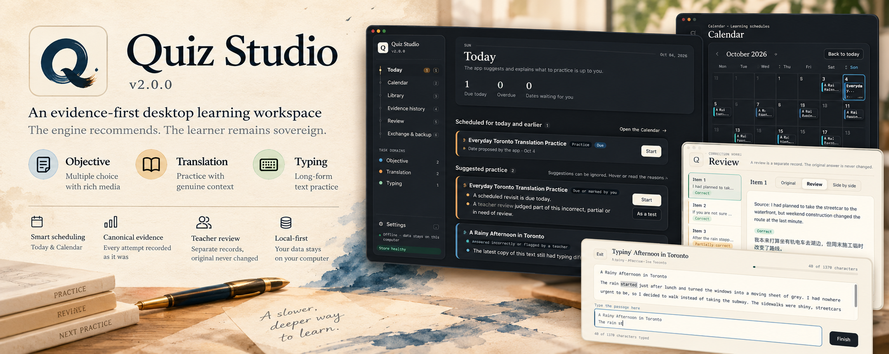
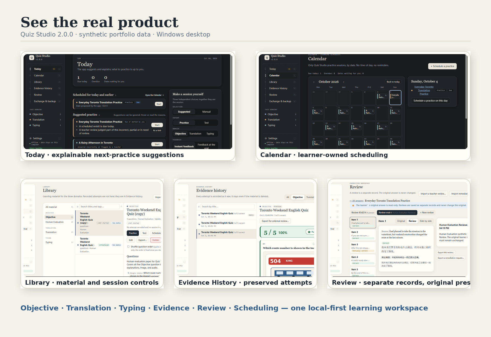
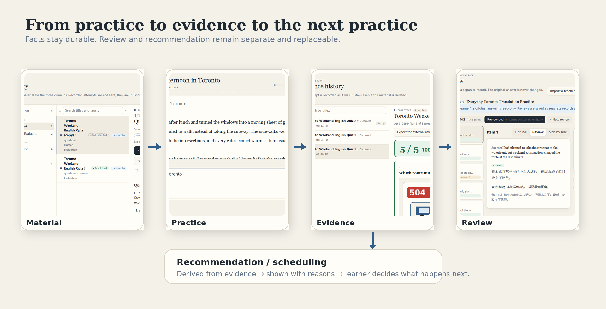
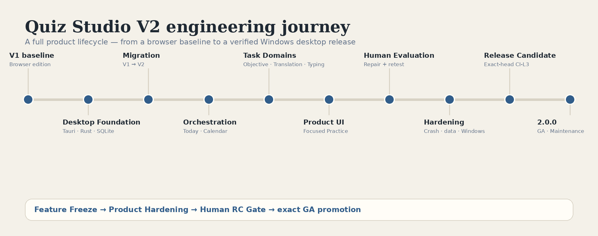

# Quiz Studio

<p align="center">
  
</p>

<p align="center">
  <strong>An evidence-first Windows desktop learning workspace for deliberate practice, scheduling, review, and durable learning history.</strong>
</p>

<p align="center">
  The engine recommends. The learner remains sovereign.
</p>

<p align="center">
  <a href="https://github.com/Peter-S-Shi/Quiz-System/releases/tag/v2.0.0"><strong>Download v2.0.0</strong></a>
  ·
  <a href="#see-the-real-product">See the real product</a>
  ·
  <a href="#engineering-depth">Engineering</a>
  ·
  <a href="docs/V2_QUICKSTART.md">Quick start</a>
  ·
  <a href="README.zh-CN.md">中文说明</a>
</p>

<p align="center">
  <a href="https://github.com/Peter-S-Shi/Quiz-System/releases"></a>
  
  
  
  <a href="LICENSE"></a>
</p>

Quiz Studio is built around a simple learning principle:

> **Evidence is canonical. Interpretation is replaceable.**

What you actually answered, typed, marked, reviewed, retried, or scheduled should remain inspectable as evidence. Recommendations, review judgments, and scheduling decisions can evolve without rewriting that history.

Quiz Studio brings **Objective**, **Translation**, and **Typing** practice into one local-first desktop workspace, then connects each finished session to **Evidence History**, **Review**, **Today**, and **Calendar** so the next practice decision is informed without becoming automatic or opaque.

---

## See the real product

The screens below come from the released **v2.0.0** Windows desktop build using synthetic portfolio data.

<p align="center">
  
</p>

Quiz Studio is not a quiz page with a history tab bolted on. It is a learning workspace where material, practice, evidence, review, and scheduling remain connected while preserving clear ownership boundaries.

---

## Why Quiz Studio?

| Evidence stays honest | Recommendations stay explainable | Your data stays yours |
| --- | --- | --- |
| Finished attempts are preserved as recorded facts. Editing or deleting source material does not silently rewrite prior learning evidence. | Today and Calendar can suggest what deserves attention and explain why, but the learner can ignore, reschedule, start manually, or choose a different domain or intent. | Core data stays on-device. No account, cloud database, telemetry service, or embedded remote AI is required for normal use. |

---

## One workspace, three learning domains

### Objective

Create and practice papers with five question types: single choice, multiple choice, fill-in-the-blank, true/false, and one-to-one matching.

Objective practice supports:

- **Instant feedback** or **submit-at-the-end** test behavior;
- optional question-order shuffling per session;
- image and audio attachments;
- answer explanations revealed at the correct feedback boundary;
- retry of incorrect items;
- durable result snapshots that keep the explanation and answer state from the completed attempt.

### Translation

Translation practice is deliberately qualitative. It does not collapse a translation into a fake numeric score.

Learners can:

- translate sentence by sentence;
- mark uncertainty before submission;
- preserve the original learner response as read-only evidence;
- create or import separate Teacher Review records;
- retry full material or targeted needs-work items;
- exchange review requests and teacher reviews as portable files.

### Typing

Typing practice is designed for long-form committed text rather than raw key logging.

It supports:

- long passages;
- real IME committed-text input;
- practice and test intent;
- deterministic grapheme-level comparison;
- retry of remaining errors;
- saved duration and durable attempt history;
- resume after interruption without turning typing speed into a mastery score.

---

## From practice to evidence to the next practice

<p align="center">
  
</p>

```text
Material
   │
   ▼
Focused Practice
   │
   ▼
Canonical Evidence
   │
   ├────────► Teacher Review / external review
   │
   ├────────► Retry / remediation
   │
   └────────► Today / Calendar recommendations
                         │
                         ▼
                 Learner decides
```

This separation is intentional:

- **Evidence** records what happened.
- **Review** adds interpretation without mutating the original answer.
- **Scheduling** adds context without becoming evidence.
- **Recommendation** is derived and replaceable, not stored as truth.

---

## Scheduling without surrendering control

Quiz Studio includes a lightweight learning schedule rather than a full productivity planner.

**Today** surfaces sessions due today, overdue work, unfinished sessions, and suggestions with readable reasons.

**Calendar** provides date-based practice scheduling with recurrence, rescheduling, cancellation, and occurrence-level handling.

Important rule: **manual schedules are sovereign**. The engine does not silently overwrite a learner-created schedule. When the engine and learner disagree, Quiz Studio presents the difference instead of resolving it behind the scenes.

---

## Review, remediation, and Open Teaching Interchange

A Translation learner response is immutable evidence. A Teacher Review is a separate record.

That means a teacher — human or external AI — can evaluate an answer without replacing what the learner originally wrote.

Quiz Studio supports a file-based **Open Teaching Interchange** flow:

```text
Learner Response
      │
      ▼
review-request.json
      │
      ├────► Human teacher
      └────► External AI assistant
                    │
                    ▼
          teacher-review.json
                    │
                    ▼
             Quiz Studio Review
                    │
                    ▼
          Retry / remediation
```

No API key or cloud account is required inside Quiz Studio. Export happens only when the learner explicitly chooses to create a file.

---

## Library, Evidence History, and durable state

The **Library** contains learning material, not historical attempts. Each item shows a factual state: **Not started**, **In progress**, or **Practiced**. These are operational facts, not mastery labels.

**Evidence History** is the durable record of completed practice. Attempts remain visible even if the source material later changes or is deleted.

That distinction matters: material is editable; historical evidence is not silently rewritten.

---

## Local-first by design

```text
Objective papers · Translation documents · Typing texts
                 │
                 ▼
          Focused Practice
                 │
                 ▼
     SQLite + content-addressed media
                 │
       ┌─────────┴─────────┐
       ▼                   ▼
Evidence / Review      Backup / Restore
       │
       └─────────► Your Windows device
```

Core use is local and offline:

- no user account;
- no hosted database;
- no telemetry;
- no remote AI dependency;
- no CDN or network font dependency;
- no browser-origin canonical storage.

The only installer network exception is WebView2 bootstrap when the runtime is missing.

---

## Backup, restore, and V1 migration

Quiz Studio V2 treats data durability as a product feature.

### Backup / restore

**Exchange & backup** creates a versioned archive containing structured data and media. Restore validates before activation and preserves a safety snapshot of the replaced state.

### V1 → V2 migration

The desktop app can import Quiz Studio V1 backups through a staged migration pipeline.

Migration preserves supported historical data, media references, Teacher Reviews, retry lineage, timestamps where they existed, and recovery artifacts without silently activating ambiguous or invalid state. Invalid or truncated sources fail closed.

---

## Engineering depth

Quiz Studio is a portfolio project because of the engineering decisions behind the product, not because of its dependency list.

| Engineering area | What the project demonstrates |
| --- | --- |
| **Evidence-first domain architecture** | Evidence, Scheduling Context, Review, and Recommendation are separate contracts rather than one overloaded record type. |
| **Local-first desktop durability** | Rust-owned SQLite persistence, one-unit-of-work commits, staging/activation, snapshots, recovery, and content-addressed media. |
| **Loss-aware migration** | V1 intake is read-only, staged, schema-detected, previewed, and activated atomically with explicit conservation rules. |
| **Learner-sovereign orchestration** | Date-only schedules, recurrence, occurrence identity, manual ownership, explainable recommendations, and no silent overwrite of learner choices. |
| **Input correctness** | Typing uses project-controlled grapheme comparison semantics and accepts committed text from IMEs without relying only on composition lifecycle events. |
| **Desktop-native verification** | Real Windows packaging, clean install, upgrade preservation, uninstall behavior, packaged smoke, crash/recovery checks, and exact-candidate SHA-256 evidence. |
| **Risk-scaled delivery** | CI depth follows lifecycle risk: focused development checks, milestone CI-L2, and exact-candidate CI-L3 for release packaging. |

<p align="center">
  
</p>

```text
V1 baseline
   ↓
Desktop Foundation
   ↓
V1 Migration
   ↓
Scheduling + Recommendation
   ↓
Objective / Translation / Typing integration
   ↓
Focused Practice + Product UI
   ↓
Human Evaluation
   ↓
Product Hardening
   ↓
Release Candidate
   ↓
Quiz Studio 2.0.0
```

For the detailed verification record, see [PROJECT_STATUS.md](PROJECT_STATUS.md), [ROADMAP.md](ROADMAP.md), and [docs/V2_RELEASE_CANDIDATE.md](docs/V2_RELEASE_CANDIDATE.md).

---

## Download Quiz Studio 2.0.0

### Windows

1. Open the [Quiz Studio v2.0.0 GitHub Release](https://github.com/Peter-S-Shi/Quiz-System/releases/tag/v2.0.0).
2. Download `quiz-studio_2.0.0_x64-setup.exe`.
3. Optionally verify the SHA-256 value against `SHA256SUMS.txt`.
4. Run the per-user installer.
5. Launch **Quiz Studio** from the Start Menu.

Administrator rights are not required for the normal per-user install.

The installer is currently unsigned, so Windows may show an unknown-publisher / unrecognized-app warning.

---

## Known limitations in 2.0.0

- **Windows only.** Windows 11 / WebView2 is the verified platform. macOS and Linux are not supported or verified.
- **Unsigned installer.** Code signing is not part of the 2.0.0 release.
- **No automatic self-update.** Updating is a manual release/install workflow.
- **Large histories cost more to read.** At roughly 5,000 completed sessions on the measured release build, Library readiness was about 0.9 s and Today about 1.6 s on the reference machine. No data-integrity issue was observed.
- **Export writes directly to the chosen destination.** Export does not modify Quiz Studio's canonical store, but the selected export file is written in place.

---

## Intentional boundaries

Quiz Studio 2.0.0 deliberately does **not** try to become:

- a cloud account platform;
- a collaboration SaaS;
- a full goal / exam / workload planner;
- a mastery-scoring engine;
- a gamified streak system;
- an embedded AI tutor;
- an automatic scheduler that overrides learner decisions;
- a macOS release.

External AI can participate through exported review files, but the core product remains useful without it.

---

## Technology

**Desktop:** Tauri 2 · Rust · WebView2 · Windows/MSVC · NSIS  
**Local data:** SQLite · content-addressed media · staged activation / recovery  
**UI:** HTML · CSS · JavaScript ES modules  
**Testing:** Node test runner · Rust tests · headless Edge · packaged WebView2 checks · installer/upgrade acceptance  
**Delivery:** GitHub Actions · GitHub Releases

Technology choices support the product architecture; they are not the product story by themselves.

---

## Build from source

Authoritative desktop prerequisites and commands live in [`desktop/README.md`](desktop/README.md).

On Windows, the release path uses the MSVC Rust toolchain, Node 22+, and Tauri CLI 2.12.1.

```powershell
cd desktop
. .\scripts\env.ps1

node --test "ui/tests/*.spec.mjs"
cargo fmt --all -- --check
cargo clippy --workspace --all-targets -- -D warnings
cargo test --workspace --exclude qs-desktop

cd app/src-tauri
cargo tauri build --bundles nsis
```

For packaged-app, migration, fault-injection, recovery, and installer acceptance details, use [`desktop/README.md`](desktop/README.md) and the V2 milestone records.

---

## Deeper technical documentation

- [`docs/V2_QUICKSTART.md`](docs/V2_QUICKSTART.md) — released desktop quick start
- [`V2_PRODUCT_SCOPE_FREEZE.md`](V2_PRODUCT_SCOPE_FREEZE.md) — V2 product boundary and accepted scope
- [`docs/V2_DESKTOP_FOUNDATION.md`](docs/V2_DESKTOP_FOUNDATION.md) — desktop architecture and durability foundation
- [`docs/V2_MIGRATION.md`](docs/V2_MIGRATION.md) — V1 → V2 migration architecture and evidence
- [`docs/V2_ORCHESTRATION.md`](docs/V2_ORCHESTRATION.md) — scheduling, recommendation, and Calendar
- [`docs/V2_TASK_DOMAINS.md`](docs/V2_TASK_DOMAINS.md) — Objective, Translation, Typing, and evidence integration
- [`docs/V2_PRODUCT_UI.md`](docs/V2_PRODUCT_UI.md) — final product UI integration
- [`docs/V2_HARDENING.md`](docs/V2_HARDENING.md) — Product Hardening evidence
- [`docs/V2_RELEASE_CANDIDATE.md`](docs/V2_RELEASE_CANDIDATE.md) — RC / release provenance and exact-candidate evidence
- [`PROJECT_STATUS.md`](PROJECT_STATUS.md) — authoritative lifecycle state
- [`ROADMAP.md`](ROADMAP.md) — milestone history

---

## V1 historical edition

Quiz Studio V1 (`v1.0.0`) remains preserved in this repository as the earlier browser-based edition and as the migration source for V2.

V1's browser architecture, public JSON schemas, Open Teaching Interchange work, and historical documentation remain useful project evidence, but **Quiz Studio V2 `2.0.0` is the current released product**.

---

## Release status

**Current release:** `v2.0.0`  
**Lifecycle state:** Released / Maintenance  
**Verified platform:** Windows  
**License:** [MIT](LICENSE)

The accepted V2 release completed Feature Freeze, Product Hardening, exact-candidate CI-L3, packaged Windows acceptance, and Human RC Gate review before publication.
