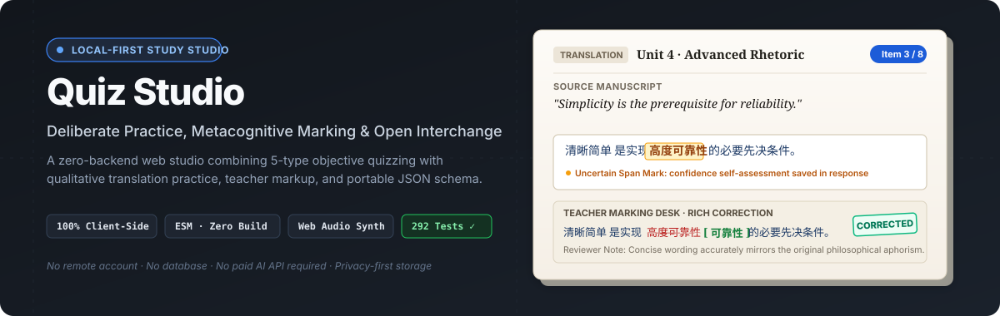
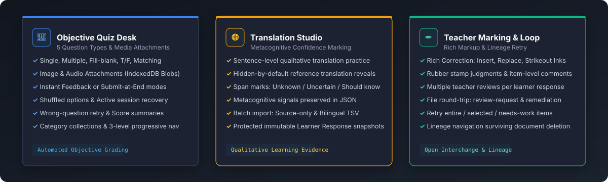
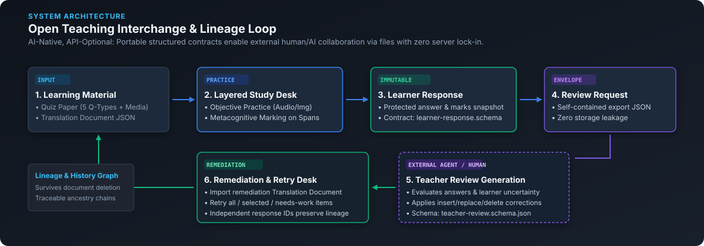

# Quiz Studio

<p align="center">
  
</p>

<p align="center">
  <a href="#quick-start"></a>
  <a href="#engineering-highlights"></a>
  <a href="#engineering-highlights"></a>
  <a href="docs/OPEN_TEACHING_INTERCHANGE.md"></a>
  <a href="LICENSE"></a>
  <a href="README.zh-CN.md"></a>
</p>

---

## Overview

**Quiz Studio** is a distraction-free, local-first personal learning workspace and practice studio. It provides a tactile **Layered Paper Study Desk** experience that unites two complementary learning workflows:
1. **Objective Quiz Practice**: Multi-type testing with rich media attachments, instant/deferred feedback, session recovery, and wrong-question retries.
2. **Qualitative Translation Studio**: Sentence-level translation practice with learner metacognitive uncertainty marking, rich teacher correction workspaces, and portable file-based interchange.

Quiz Studio is **AI-Native and API-Optional**: it supports rich collaborative review and remediation with outside human teachers or external AI assistants (ChatGPT, Claude, Codex, local LLMs) via portable, versioned JSON schemas—**without requiring an embedded backend database, user accounts, network tracking, or paid API keys**.

---

## Core Capabilities

<p align="center">
  
</p>

### 1. Objective Quiz Desk & Paper Authoring
- **5 Supported Question Types**: Single-choice, multiple-choice, fill-in-the-blank, true/false, and one-to-one matching.
- **Embedded Media Attachments**: Attach images (with modal zoom viewer) and audio (with inline playback) backed by client-side IndexedDB Blob storage.
- **Flexible Practice Modes**: Choose between *Instant Feedback* (per-question checking with correction hints) or *Submit-at-End* (simulated test environment).
- **Session Durability & Shuffling**: Randomize question order and options; recover in-progress sessions seamlessly across browser refreshes.
- **Library Organization**: 3-level progressive sidebar navigation (Category → Paper → Question), search, tagging, and one-click JSON import/export.

### 2. Translation Studio with Metacognitive Marking
- **Qualitative Deliberate Practice**: Sentence-by-sentence translation interface with hidden-by-default reference reveals that never force simplistic auto-grading.
- **Metacognitive Confidence Marking**: Learners highlight specific spans of their own translations and tag them as **Unknown**, **Uncertain**, or **Should know** before submission.
- **Batch Material Ingestion**: Fast bulk import via source-only text or bilingual TSV (`source<TAB>reference`) rows.
- **Protected Learner Evidence**: Finalizing practice creates an immutable, timestamped Learner Response snapshot preserving original answers and confidence marks.

### 3. Teacher Marking Desk & Rich Correction
- **Tactile Ink Annotations**: Reviewers apply presentation styling (**Bold**, **Italic**, **Highlight**, **Underline**, custom reviewer ink) and structural corrections (**Insert**, **Replace**, **Strikeout Delete**).
- **Reviewer Judgments & Feedback**: Assign stamp judgments (*Correct*, *Incorrect*, *Partial*, *Needs review*), item-level comments, and suggested full-sentence revisions.
- **Multiple Concurrent Reviews**: A single learner response can accumulate multiple independent reviews over time without mutating the original learner submission.

### 4. Lineage History & Targeted Retry Loop
- **Durable Evidence Archive**: Browse all finalized responses, review statuses, and lineage relationships—even after originating practice documents are deleted.
- **Targeted Retry Modes**: Retry an entire paper, select specific items, or automatically trigger **Retry Needs-Work Items** (extracting items with uncertainty marks or reviewer corrections into a focused attempt).
- **Lineage Integrity**: Full bidirectional lineage tracking (`resolveResponseLineage`) across retries and remediations with safe cascading deletion protection.

---

## Architecture: Open Teaching Interchange

Quiz Studio introduces the **Open Teaching Interchange (OTI)** architecture—a file-based protocol for asynchronous pedagogical collaboration between learners, human teachers, and AI agents.

<p align="center">
  
</p>

```text
External Authoring (JSON / AI Prompts)
  │
  ▼
Learner Practice Desk (Objective Quizzes & Translation Studio)
  │
  ▼
Finalized Protected Evidence (Immutable Learner Response)
  │
  ├──► Export "review-request.json" ──► External Teacher / AI Reviewer
  │                                                │
  ▼                                                ▼
Targeted Retry / Remediation ◄── Import "teacher-review.json"
```

### Why File-Based Interchange?
- **Zero API Key Friction**: No need to configure OpenAI, Anthropic, or cloud API keys inside the application.
- **Universal Model Compatibility**: Export a `quiz-studio.review-request` JSON file, feed it to any LLM prompt, web interface, or human tutor, and import the resulting `quiz-studio.teacher-review` JSON.
- **Data Sovereignty**: Educational data never leaves the user's computer unless the user explicitly chooses to export and share a specific file.

---

## Engineering Highlights

### 1. 100% Local-First & Dual-Storage Architecture
- Built with **vanilla ES Modules (ESM)**, plain HTML5, and modern CSS—no webpack, Vite, React, or build step required.
- **Dual Client Storage Strategy**:
  - `localStorage` for fast structured metadata, quiz papers, translation documents, and history indexes.
  - `IndexedDB` (`quiz-studio-media-db`) for audio/image binary blobs, preventing storage quota starvation.
- Full **Service Worker ESM precache** for true offline execution.

### 2. Character-Anchored Metacognitive Engine
- Custom span-level annotation algorithms anchor marks to exact character indices within learner answers.
- **Deterministic Collision Resolution**: Handles overlapping selections, edits, and deletions safely while preserving mark provenance upon submission.

### 3. Procedural Web Audio Synthesis
- Dynamic sound engine using the native **Web Audio API** with zero external audio assets:
  - *Paper Rustle*: Exponential bandpass sweep across white/brown noise (180ms).
  - *Pencil / Ink Scratch*: High-Q bandpass noise bursts simulating writing on laid paper (90ms).
  - *Rubber Stamp Thud*: Resonant low-frequency sine oscillator with impact click (120ms).
- Fully configurable with instant topbar toggle and respects system `prefers-reduced-motion`.

### 4. Public Versioned JSON Schema Contracts
- Formal schemas maintained under [`schemas/`](schemas/):
  - [`quiz-paper.schema.json`](schemas/quiz-paper.schema.json): Standardized objective quiz package.
  - [`learner-response.schema.json`](schemas/learner-response.schema.json): Finalized learning evidence.
  - [`teacher-review.schema.json`](schemas/teacher-review.schema.json): Rich corrections, judgments, and annotations.
  - [`translation-document.schema.json`](schemas/translation-document.schema.json): Qualitative translation curriculum.
  - [`review-request.schema.json`](schemas/review-request.schema.json) & [`remediation-request.schema.json`](schemas/remediation-request.schema.json): Portable interchange envelopes.

### 5. Automated Verification Rig
- Comprehensive test suite covering question validation, grading engines, annotation collision handling, schema contracts, and storage migrations:
  ```bash
  node --test
  ```
- **292 unit and integration tests passing** with 0 external test dependencies.

---

## Quick Start

### Prerequisites
- Python 3.8+ (for local static runtime) or Node.js 18+
- Modern web browser (Chrome, Edge, Firefox, Safari)

### Option A: Windows 1-Click Launcher
Double-click `start-local.bat` in the repository root.
> *The launcher automatically starts the local Python runtime on `http://localhost:8000` and opens your default browser.*

### Option B: Terminal Launch
```bash
# Start the canonical local server
python -u scripts/dev-server.py
```
Open **`http://localhost:8000`** in your browser.

> [!NOTE]
> Port `8000` is strict by design because browser storage (localStorage & IndexedDB) is origin-bound. Direct `file://` opening is unsupported due to ES module security policies.

---

## Validation & Quality Checks

Run the automated test suite and syntax verification:

```bash
# Validate core syntax
node --check src/app.js

# Execute complete test suite (292 tests)
node --test
```

---

## First 60-Second Walkthrough

```text
1. Launch ──► Open http://localhost:8000
2. Choose ──► Select "Objective Practice" or "Translation Studio"
3. Practice ──► Answer questions or translate sentences with confidence marks
4. Finalize ──► Finish attempt to save immutable Learner Response
5. Review ──► Open Teacher Marking Desk or export JSON for external review
```

1. **Try Objective Quiz**: Click on any preloaded sample paper in the **Library**, select **Practice**, answer questions, and inspect the immediate feedback and score comparison.
2. **Try Translation Practice**: Switch to the **Translation** tab, open a sample document, start practice, type your translation, and highlight a word to tag it as **Uncertain**.
3. **Try Rich Correction**: Finish your translation attempt, select **Open Correction Workspace**, select a phrase in the learner's translation, and apply **Replace** or a **Teacher Stamp**.

---

## Repository Structure

```text
Quiz System/
├── assets/readme/          # Project-native SVG banners, architecture, & feature diagrams
├── docs/                   # Detailed specifications & guides
│   ├── USER_GUIDE.md               # Complete end-user guide (EN / zh-CN)
│   ├── DEVELOPER_GUIDE.md          # Architecture & developer specification
│   ├── OPEN_TEACHING_INTERCHANGE.md # Data interchange specification
│   ├── TRANSLATION_DOMAIN.md       # Translation domain model
│   └── SAFETY.md                   # Privacy, security, & data handling principles
├── examples/               # Synthetic sample papers and interchange JSON fixtures
├── schemas/                # Public JSON Schema contracts (v1.0.0)
├── scripts/                # Python local development server
├── src/                    # Application source (Vanilla ESM)
│   ├── core/               # Quiz models, grading, annotation engine, & history
│   ├── storage/            # Browser localStorage & IndexedDB storage boundary
│   └── app.js              # UI controller, routing, and localization engine
├── tests/                  # Automated test suite (292 tests)
├── DESIGN.md               # Layered Paper Study Desk design system & tokens
├── PROJECT_STATUS.md       # Lifecycle roadmap & release candidate status
├── index.html              # Application entrypoint & DOM shell
├── styles.css              # Study desk theme & responsive stylesheets
└── sw.js                   # Service Worker precache for offline support
```

---

## Data Sovereignty & Privacy

- **Zero Remote Tracking**: Quiz papers, practice drafts, media attachments, score history, and annotations remain strictly inside your browser's local storage.
- **No In-App Telemetry**: No third-party analytics, tracking pixels, or remote database sync.
- **Export Control**: All exported JSON files remain completely under the user's manual control.

---

## Project Status & License

- **Current Version**: `v1.0.0-rc.1` (Feature Complete / Maintenance Hold)
- **Design System**: Layered Paper Study Desk (`DESIGN.md`)
- **License**: [MIT License](LICENSE) © 2026 Quiz Studio Contributors
